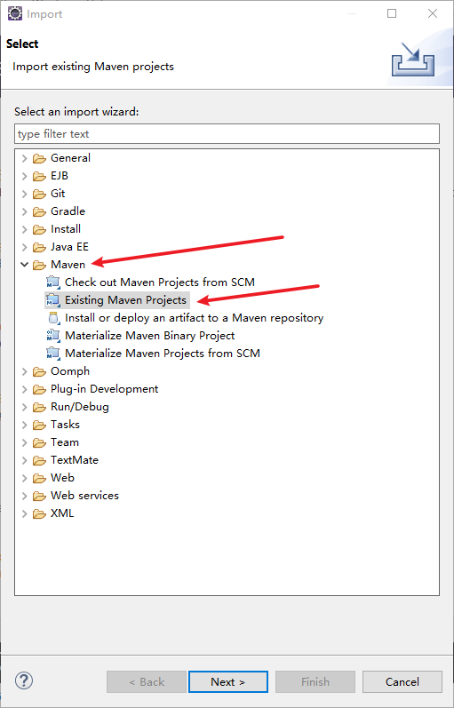
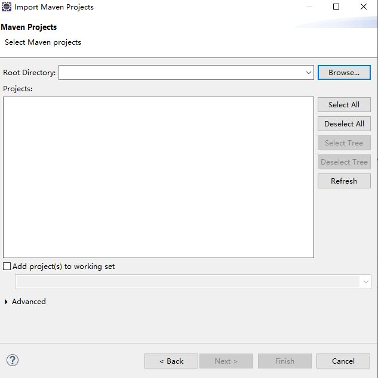
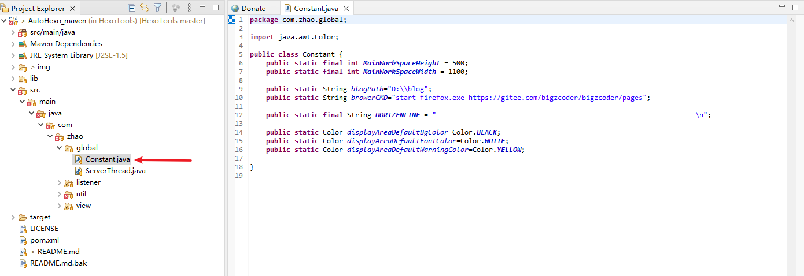

## hexo自动化工具

为了解决hexo每次写文章都需要输一堆命令，写文章的时候需要手动创建以及添加配置，以及gitee更新还需要登录账号这好多步骤的操作，于是想要把所有的操作集中到一个GUI的工具执行

<!-- more -->

### 环境准备

1. 首先需要安装并且配置环境变量`node.js`、`Git`
2. 然后配置VisialCode到环境变量
3. 配置自己习惯用的浏览器，将目录配到环境变量，并且复制浏览器所在目录里运行程序的名称，比如`firefox.exe`
5. 搭建java的开发环境，安装jre和jdk，具体安装方法请[百度](http://www.baidu.com)

### 源码的使用

程序采用java源码开发的图形界面  

1. 首先下载源码开发的IDE --> eclipse

2. 打开Eclipse，`File-Import-Maven-Existing Maven Projects`

    

    选择项目路径，然后点击'Finish'将项目添加进来，等待`Importing Maven projects`

    

3. 修改`/AutoHexo_maven/src/main/java/com/zhao/global/Constant.java`中的`browerCMD`命令

    

    使用本机浏览器开启对应网站。

    ```
    start firefox.exe https://gitee.com/bigzcoder/bigzcoder/pages
    ```

4. 导出jar包到桌面，方便以后每次使用

> 注意eclipse导包整个过程需要联网，需要配合maven下载对应的jar包。

### 程序的使用

1. 首先需要配置博客，配置博客目录可用通过UI选择， 也可以直接写死到代码中

    `com.zhao.global.Constant.blogPath`

2. 设置浏览器，修改源码里`browerCMD`命令（详情见源码的使用）
3. 设置好前两步，其他功能就能使用了。

### 程序原理

* 调试时候调用了 `npx hexo s`命令
* 关闭调试调用了 `cmd /c taskkill /f /t /im node.exe`命令
* 打包&部署&更新调用了`cd " + Constant.blogPath + " | npx hexo g | npx hexo d",Constant.browerCMD`
* 新建文章实际上是在目录通过IO写入文件（默认带图片资源文件夹）

### 修复

> 2020年7月16日09:26:29 

修复了hexo d命令中的io堵塞问题，并采用了powershell的jar包  
修复了使用说明
修复了README.md  
修复了创建文章乱码问题

> 2021年2月10日12:16:16

修复了调试关闭按钮事件中rThread为null导致的错误  
修复了因为gitee的接口更新关闭，提供了浏览器跳转相关页面的操作  
修复了UI宽度的显示错误  
去掉了重复的打包功能  
更改了文本框字体